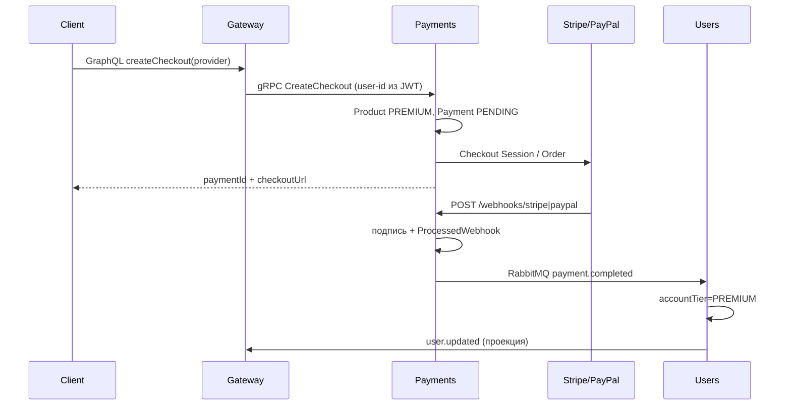

# Payments

Приватный сервис разовых покупок PREMIUM: Stripe Checkout и PayPal Orders API v2. Публичный GraphQL — только на gateway (`createCheckout`, `payment`, `myPayments`). HTTP на payments: health и webhook-и провайдеров. gRPC слушает `127.0.0.1:50053`. Публичные API на `0.0.0.0` не биндить.

Исходники сгруппированы по типу (`controllers/`, `services/`, `interceptors/`). Сумму и продукт клиент не передаёт: сервер смотрит Product `PREMIUM` (999 USD).

## Чеклист после внедрения

1. **Stripe.** В Dashboard создайте тестовые ключи `sk_test_...`. Локально пересылайте webhook:

   ```bash
   stripe listen --forward-to localhost:3003/webhooks/stripe
   ```

   Значение `whsec_...` из вывода CLI положите в `STRIPE_WEBHOOK_SECRET`. Тестовая карта: `4242 4242 4242 4242`.

2. **PayPal.** В Developer Dashboard создайте sandbox-приложение, скопируйте Client ID / Secret. Для webhook нужен публичный HTTPS-URL: `pnpm run ngrok:dev -- 3003` и endpoint `https://<host>/webhooks/paypal`. `PAYPAL_WEBHOOK_ID` — id webhook-подписки. Оплата — sandbox buyer.

3. Если том Postgres уже существовал, `init.sql` не выполнится повторно. Создайте БД вручную:

   ```bash
   docker compose exec postgres psql -U postgres -c "CREATE DATABASE payments;"
   ```

4. Сгенерируйте клиент, примените миграции и поднимите стек:

   ```bash
   pnpm run prisma:generate
   pnpm run prisma:migrate:payments
   pnpm run start:all
   ```

   Скопируйте новые ключи из `.env.example` в локальный `.env` (не коммитьте `.env`).

5. Проверка: login → GraphQL `createCheckout` → оплата тестовой картой/buyer → возврат на `/payments/:id` → `me.accountTier` = `PREMIUM`.

Origin web-client — `CORS_ORIGIN` (тот же, что у gateway CORS, общий корневой `.env`). Path и query игнорируются: после создания строки Payment оба return URL (success и cancel) становятся `{CORS_ORIGIN}/payments/{paymentId}` — одна страница заказа, статус берётся из БД/webhook.

## Поток оплаты



## Методы PaymentsService (`package payments`)

- `CreateCheckout` — `provider`, опционально `product_code` (по умолчанию PREMIUM). User id только из metadata `user-id`.
- `GetPayment` / `ListMyPayments` — только платежи текущего пользователя.

Webhook HTTP **не** требует `x-internal-token`. gRPC — требует.
