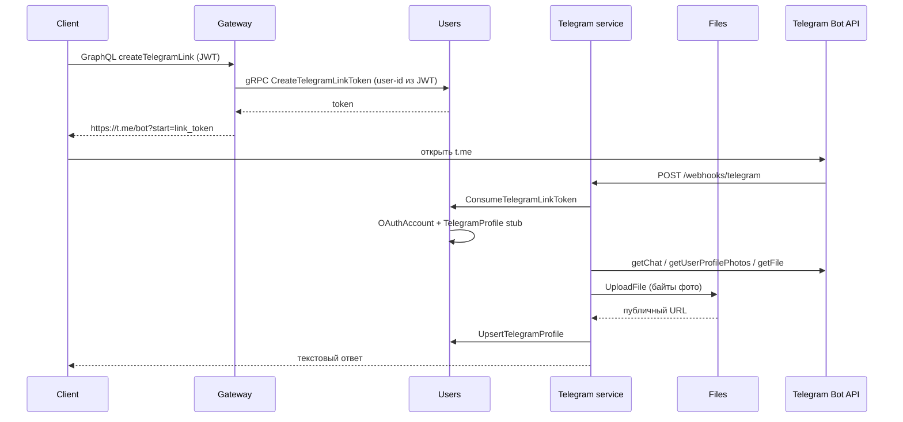

# Telegram

HTTP-сервис бота (grammy, webhook). gRPC-сервер и БД отсутствуют: привязка аккаунта и снимок профиля идут через gRPC-клиент к `users`. Фото профиля скачивается у Bot API и загружается в `files` (публичный URL без токена бота). Публичный GraphQL — только на gateway (`createTelegramLink`, `me.telegram`). HTTP: health и webhook Telegram. Слушает `TELEGRAM_HOST`:`TELEGRAM_PORT` (по умолчанию `127.0.0.1:3004`). Публичные API на `0.0.0.0` не биндить.

Исходники сгруппированы по типу (`controllers/`, `services/`, `grpc/`). Пользователей из Telegram не создаём: только привязка уже существующего аккаунта.

## Чеклист после внедрения

1. Создайте бота у [@BotFather](https://t.me/BotFather), сохраните токен и username. Значения положите в корневой `.env` (`TELEGRAM_BOT_TOKEN`, `TELEGRAM_BOT_USERNAME`, `TELEGRAM_WEBHOOK_SECRET`). Секреты не коммитьте.
2. Пользовательский туннель (бесплатный ngrok — один туннель; если уже открыт `:3000`, остановите его):

   ```bash
   pnpm run ngrok:dev -- 3004
   ```

   Публичный URL — `http://127.0.0.1:4040/api/tunnels`. Webhook:

   ```text
   TELEGRAM_WEBHOOK_URL=https://<host>/webhooks/telegram
   ```

   Для разового старта задайте URL в окружении процесса, не обязательно писать его в `.env`. Токен бота в URL не класть.
3. Примените миграции `users` (таблицы `TelegramLinkToken`, `TelegramProfile`) и поднимите стек:

   ```bash
   pnpm run prisma:migrate
   pnpm run start:all
   ```

   Если `start:all` уже запущен без telegram — отдельно `pnpm run start:telegram`.
4. Проверка: login на сайте → профиль → «Привязать Telegram» → открыть ссылку `t.me` → бот отвечает текстом об успешной привязке. Повторный `/start` без payload подтверждает, что Telegram уже привязан. Mini App: ngrok `:4001` → `/start` → inline «Открыть кабинет» в клиенте Telegram → профиль → «Видео». В обычном браузере по тому же URL — только «откройте в Telegram». Без привязки — нет кабинета, есть «Как привязать аккаунт».

Webhook HTTP **не** требует `x-internal-token`. Проверка — заголовок `X-Telegram-Bot-Api-Secret-Token`. gRPC к users — требует `x-internal-token`.

## Поток привязки



Ответы `/start` — текст плюс клавиатура, если задан `TELEGRAM_MINI_APP_URL`. Без этой переменной поведение прежнее: только текст.

## Mini App

Кабинет — отдельный SPA `apps/telegram-mini-app` (порт 4001). Бот не отдаёт JWT: вход по `initData` через GraphQL `loginWithTelegram`.

1. Привяжите Telegram в профиле на сайте (как раньше).
2. Поднимите SPA и один туннель на Mini App:

   ```bash
   pnpm run start:telegram-mini
   pnpm run ngrok:dev -- 4001
   ```

   Полный HTTPS-URL (включая `.ngrok-free.app`) запишите в `TELEGRAM_MINI_APP_URL` и укажите BotFather (кнопка меню / Mini App). Перезапустите `telegram`, чтобы `/start` начал слать webApp-кнопки.
3. Бесплатный ngrok — **один** туннель. Если уже открыт `:3004` (webhook) или `:3000`, остановите его перед `:4001`. Пока туннель смотрит на Mini App, webhook, зарегистрированный ранее, может перестать обновляться.
4. GraphQL с телефона идёт на тот же хост: `https://<ngrok>/graphql` → Vite проксирует на gateway `:3000`. Отдельный туннель на 3000 для Mini App не нужен.

У reply-кнопки `webApp('Кабинет')` **нет** `initData`. Рабочий вход — inline «Открыть кабинет» под сообщением `/start`.

## Команды бота

- `/start` — если Telegram уже в `OAuthAccount`, пишет что аккаунт привязан и обновляет снимок профиля (`getChat` + фото). Если задан `TELEGRAM_MINI_APP_URL`: reply-клавиатура «Кабинет» (webApp) + «Мои видео», плюс отдельное сообщение с inline «Открыть кабинет» (у Telegram в одном `reply_markup` нельзя совместить reply- и inline-клавиатуру). Иначе просит открыть кнопку в профиле; при заданном URL — кнопка «Как привязать аккаунт».
- `/start link_<token>` — одноразовая привязка (TTL токена ~10 мин). Чужой telegram id → конфликт. Повтор для того же пользователя — успех. После привязки сервис сохраняет имена и публичный URL аватара в `TelegramProfile`; при заданном Mini App URL показывает ту же видео-клавиатуру.
- «Мои видео» — если привязан: сообщение + inline webApp на `{TELEGRAM_MINI_APP_URL}/videos`; иначе инструкция привязки.
- «Как привязать аккаунт» — тот же текст, что у непривязанного `/start`.

Фото никогда не отдаётся как `https://api.telegram.org/file/bot<token>/...`: файл качается на сервисе telegram и кладётся в MinIO через files gRPC.
