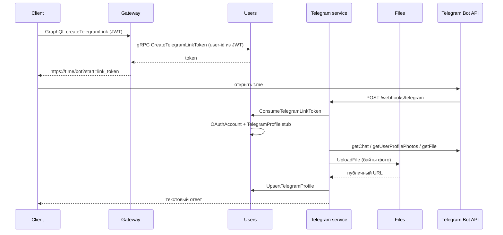

# Telegram

HTTP-сервис бота (grammy, webhook). gRPC-сервер и БД отсутствуют: привязка аккаунта и снимок профиля идут через gRPC-клиент к `users`. Фото профиля скачивается у Bot API и загружается в `files` (публичный URL без токена бота). Публичный GraphQL — только на gateway (`createTelegramLink`, `me.telegram`). HTTP: health и webhook Telegram. Слушает `TELEGRAM_HOST`:`TELEGRAM_PORT` (по умолчанию `127.0.0.1:3004`). Публичные API на `0.0.0.0` не биндить.

Исходники сгруппированы по типу (`controllers/`, `services/`, `grpc/`). Пользователей из Telegram не создаём: только привязка уже существующего аккаунта.

## Чеклист после внедрения

1. Создайте бота у [@BotFather](https://t.me/BotFather), сохраните токен и username. Значения положите в корневой `.env` (`TELEGRAM_BOT_TOKEN`, `TELEGRAM_BOT_USERNAME`, `TELEGRAM_WEBHOOK_SECRET`). Секреты не коммитьте.
2. Пользовательский туннель (бесплатный ngrok — один туннель; если уже открыт `:3000`, остановите его):

   ```bash
   pnpm run ngrok:dev -- 3004
   ```

   Публичный URL — `http://127.0.0.1:4040/api/tunnels`. Webhook:

   ```text
   TELEGRAM_WEBHOOK_URL=https://<host>/webhooks/telegram
   ```

   Для разового старта задайте URL в окружении процесса, не обязательно писать его в `.env`. Токен бота в URL не класть.
3. Примените миграции `users` (таблицы `TelegramLinkToken`, `TelegramProfile`) и поднимите стек:

   ```bash
   pnpm run prisma:migrate
   pnpm run start:all
   ```

   Если `start:all` уже запущен без telegram — отдельно `pnpm run start:telegram`.
4. Проверка: login на сайте → профиль → «Привязать Telegram» → открыть ссылку `t.me` → бот отвечает текстом об успешной привязке. Повторный `/start` без payload подтверждает, что Telegram уже привязан.

Webhook HTTP **не** требует `x-internal-token`. Проверка — заголовок `X-Telegram-Bot-Api-Secret-Token`. gRPC к users — требует `x-internal-token`.

## Поток привязки



## Команды бота

- `/start` — если Telegram уже в `OAuthAccount`, пишет что аккаунт привязан и обновляет снимок профиля (`getChat` + фото); иначе просит открыть кнопку в профиле.
- `/start link_<token>` — одноразовая привязка (TTL токена ~10 мин). Чужой telegram id → конфликт. Повтор для того же пользователя — успех. После привязки сервис сохраняет имена и публичный URL аватара в `TelegramProfile`.

Фото никогда не отдаётся как `https://api.telegram.org/file/bot<token>/...`: файл качается на сервисе telegram и кладётся в MinIO через files gRPC.

Ответы только текстом. Mini App не используется.
